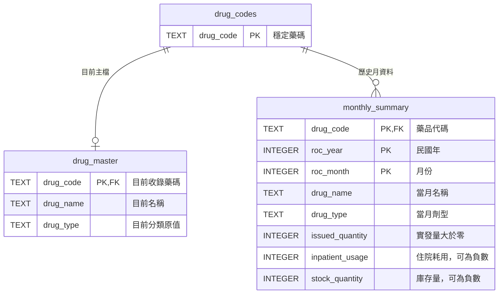

# summary.db 資料結構

SQLite schema 版本：`1`，存於 `PRAGMA user_version`。
日常更新入口為 [update_summary.py](update_summary.py)，操作方式見 [README.md](README.md)。此文件已納入 Inven_viz，沿用目前 ADR 的正實發量與歷史主檔規則；原來源規格另存於本機封存包。

SQLAlchemy 模型定義在 [manage_summary.py](manage_summary.py)，完整建表語法在 [schema.sql](schema.sql)。



## drug_codes

| 欄位 | 型別 | 限制 | 用途 |
|---|---|---|---|
| drug_code | TEXT | 主鍵、不得空白 | 穩定保存曾匯入的藥品代碼 |

首次建立時收錄全部主檔藥碼。主檔更新時新增未見過的藥碼；舊藥碼保留，即使新版主檔已移除它。代碼表是否存在該藥碼，不代表目前主檔仍收錄該藥品。

## drug_master

| 欄位 | 型別 | 來源 | 限制 |
|---|---|---|---|
| drug_code | TEXT | base.xlsx / drug_id | 主鍵、外鍵、不得空白 |
| drug_name | TEXT | base.xlsx / drug_name | 不得空白 |
| drug_type | TEXT | base.xlsx / drug_type | 不得空白 |

更新採整份主檔替換。名稱與分類以新版檔案為準；分類包含字母或數字代碼，統一存為文字，不推導代碼的業務含義。

## monthly_summary

| 欄位 | 型別 | 月檔來源欄位 | 限制 |
|---|---|---|---|
| drug_code | TEXT | 藥品代碼 | 複合主鍵、外鍵、不得空白 |
| roc_year | INTEGER | 撥補年份 | 複合主鍵、大於零 |
| roc_month | INTEGER | 撥補月份 | 複合主鍵、1–12 |
| drug_name | TEXT | 藥品名稱 | 當月名稱、不得空白 |
| drug_type | TEXT | 劑型 | 當月劑型原值、不得空白 |
| issued_quantity | INTEGER | 實發量 | 大於零 |
| inpatient_usage | INTEGER | 住院耗用 | 可為正數、零、負數 |
| stock_quantity | INTEGER | 庫存量 | 可為正數、零、負數 |

主鍵：`(drug_code, roc_year, roc_month)`。同一藥品在同一月份只能有一筆。

民國年月存為整數，例如 `115`、`1`；不轉西元。介面可將月份顯示為 `01`，不影響儲存數值。數量直接保存來源整數，不推算庫存結轉，也不增添來源未提供的單位。

月資料沒有出現某藥品，不補成零。實發量小於或等於零的來源列不儲存。同月重新匯入時，舊月份整批刪除，再存入符合條件的列；新檔涵蓋的月份即使篩選後沒有符合條件的列，也會清除舊紀錄。單一入口以月報工作表年月決定更新月份；僅有標題的有效年月表亦代表清除該月。

## 外鍵、索引與交易

兩張資料表的 `drug_code` 都參照 `drug_codes.drug_code`，刪除規則為 `ON DELETE RESTRICT`。`monthly_summary` 不直接參照 `drug_master`，所以移除目前主檔藥品不會刪除歷史月份。

所有 SQLite 連線啟用外鍵檢查。正式更新使用 `BEGIN IMMEDIATE`，避免兩個更新程序同時寫入；最多等待 30 秒取得寫入鎖。更新前建立 SQLite 備份，整次修改使用同一交易，失敗則回復。

複合主鍵支援按藥碼與年月查詢；另有 `ix_monthly_summary_period (roc_year, roc_month)` 索引，支援整月替換及月份篩選。

## 歷史與目前名稱的查詢

```sql
SELECT
    m.drug_code,
    m.roc_year,
    m.roc_month,
    m.drug_name AS monthly_name,
    d.drug_name AS current_name,
    m.drug_type AS monthly_type,
    m.issued_quantity,
    m.inpatient_usage,
    m.stock_quantity
FROM monthly_summary AS m
LEFT JOIN drug_master AS d ON d.drug_code = m.drug_code
WHERE m.roc_year = 115 AND m.roc_month = 9
ORDER BY m.drug_code;
```

主檔已移除的藥品仍會出現在結果，`current_name` 為 `NULL`，當月名稱及數量保留。

## 首次建立結果

來源為 `base.xlsx` 的 `base` 工作表，以及現有 `summay.xlsx` 的 `11501`–`11509` 工作表。

| 資料表 | 初次筆數 |
|---|---:|
| drug_codes | 2,400 |
| drug_master | 2,400 |
| monthly_summary | 3,400 |

月檔原有 3,467 筆，依實發量篩選排除 67 筆，匯入 579 個藥碼。保留 8 筆負數住院耗用及 74 筆負數庫存量。

| 民國年月 | 初次月資料筆數 |
|---|---:|
| 115/01 | 433 |
| 115/02 | 306 |
| 115/03 | 373 |
| 115/04 | 394 |
| 115/05 | 380 |
| 115/06 | 406 |
| 115/07 | 372 |
| 115/08 | 369 |
| 115/09 | 367 |
